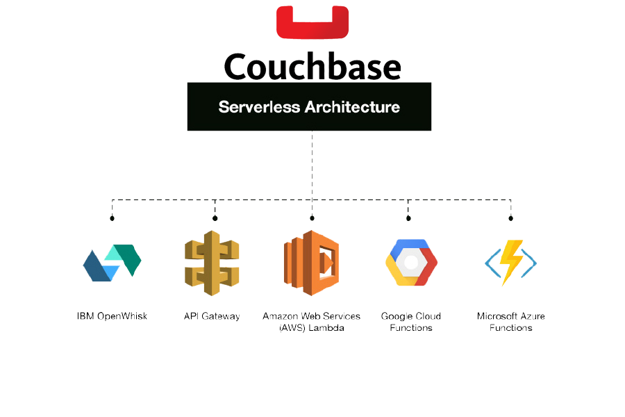

# Serverless couchbase
[](https://github.com/stoqey/serverless-couchbase/)

[](https://www.npmjs.com/package/@stoqey/serverless-couchbase)
[](https://www.npmjs.com/package/@stoqey/serverless-couchbase)

### A module for managing Couchbase connections at *serverless* scale.

Serverless Couchbase is a wrapper for Stoqey's amazing **[Sofa](https://github.com/stoqey/sofa)** Node.js module. Normally, using the `couchbase` module with Node apps would be just fine. However, serverless functions (like AWS Lambda, Google Cloud Functions, and Azure Functions) scale almost infinitely by creating separate instances for each concurrent user. This is a **MAJOR PROBLEM** for DBs solutions like Couchbase, because available connections can be quickly maxed out by competing functions. Not anymore. 😀

Serverless Couchbase adds a connection management component to the `couchbase` module that is designed specifically for use with serverless applications. This module constantly monitors the number of connections being utilized, and then based on your settings, manages those connections to allow thousands of concurrent executions to share them. It will clean up zombies, enforce connection limits per user, and retry connections using trusted backoff algorithms.

**NOTE:** This module *should* work with any standards-based Couchbase server..

## Simple Example

```javascript
// Require and initialize outside of your main handler
const couchbase = require('serverless-couchbase')({
  config: {
    connectionString: string;
    bucketName: string; // process.env.COUCHBASE_BUCKET,
    username: string;
    password: string;
  }
})

// Main handler function
exports.handler = async (event, context) => {
  // Run your query
  let results = await couchbase.query('SELECT * FROM table')

  // Run clean up function
  await couchbase.end()

  // Return the results
  return results
}
```

## Installation
```
npm i serverless-couchbase
```

## Requirements
- Node 8.10+
- Couchbase server/cluster

## Considerations for this module
- Return promises for easy async request handling
- Exponential backoff (using [Jitter](https://aws.amazon.com/blogs/architecture/exponential-backoff-and-jitter/)) to handle failed connections
- Monitor active connections and disconnect if more than X% of connections are being used
- Support transactions
- Support JIT connections
- Assume AWS endorsed best practices from [here](https://github.com/aws-samples/aws-appsync-rds-aurora-sample/blob/master/src/lamdaresolver/index.js)

## How to use this module
Serverless Couchbase wraps the **[sofa](https://github.com/stoqey/sofa)** module, so this module supports pretty much everything that the `couchbase` module does. It uses all the same connection options, provides a `query()` method that accepts the same arguments when [performing queries](https://github.com/stoqey/sofa#queries) (except the callback), and passes back the query results exactly as the `couchbase` module returns them. There are a few things that don't make sense in serverless environments, like streaming rows, so there is no support for that yet.

To use Serverless Couchbase, require it **OUTSIDE** your main function handler. This will allow for connection reuse between executions. The module must be initialized before its methods are available. [Configuration options](#configuration-options) must be passed in during initialization.

```javascript
// Require and initialize with default options
const couchbase = require('serverless-couchbase')() // <-- initialize with function call

// OR include configuration options
const couchbase = require('serverless-couchbase')({
  backoff: 'decorrelated',
  base: 5,
  cap: 200
})
```

Couchbase connection options can be passed in at initialization or later using the `config()` method.

```javascript
couchbase.config({
  connectionString: string;
  bucketName: string; // process.env.COUCHBASE_BUCKET,
  username: string;
  password: string;
})
```

You can explicitly establish a connection using the `connect()` method if you want to, though it isn't necessary. This method returns a promise, so you'll need to `await` the response or wrap it in a promise chain.

```javascript
await couchbase.connect()
```

Running queries is super simple using the `query()` method. It supports all [query options](https://github.com/stoqey/sofa#performing-queries) supported by the `couchbase` module, but returns a promise instead of using the standard callbacks. You either need to `await` them or wrap them in a promise chain.

```javascript
// Simple query
let results = await query('SELECT * FROM table')

// Query with placeholder values
let results = await query('SELECT * FROM table WHERE name = ?')

// Query with advanced options
let results = await query({
  sql: 'SELECT * FROM table WHERE name = ?',
  timeout: 10000
  )
})
```

Once you've run all your queries and your serverless function is ready to return data, call the `end()` method to perform connection management. This will do things like check the current number of connections, clean up zombies, or even disconnect if there are too many connections being used. Be sure to `await` its results before continuing.

```javascript
// Perform connection management tasks
await couchbase.end()
```

Note that `end()` will **NOT** necessarily terminate the connection. Only if it has to to manage the connections. If you'd like to explicitly terminate connections, use the `quit()` method.

```javascript
// Gracefully terminate the connection
couchbase.quit()
```

If you need access to the `connection` object, you can use the `getClient()` method. This will allow you to use any supported feature of the `couchbase` module directly.

```javascript
// Connect to your Couchbase instance first
await couchbase.connect()
// Get the connection object
let connection = couchbase.getClient()

```

## Configuration Options
Below is a table containing all of the possible configuration options for `serverless-couchbase`. Additional details are provided throughout the documentation.

| Property | Type | Description | Default |
| -------- | ---- | ----------- | ------- |
| library | `Function` | Custom couchbase ORM library | `@stoqey/sofa` |
| backoff | `String` or `Function` | Backoff algorithm to be used when retrying connections. Possible values are `full` and `decorrelated`, or you can also specify your own algorithm. See [Connection Backoff](#connection-backoff) for more information.  | `full` |
| base | `Integer` | Number of milliseconds added to random backoff values. | `2` |
| cap | `Integer` | Maximum number of milliseconds between connection retries. | `100` |
| config | `Object` | A `couchbase` configuration object as defined [here](https://github.com/stoqey/sofa#connection-options) | `{}` |
| connUtilization | `Number` | The percentage of total connections to use when connecting to your Couchbase server. A value of `0.75` would use 75% of your total available connections. | `0.8` |
| manageConns | `Boolean` | Flag indicating whether or not you want `serverless-couchbase` to manage Couchbase connections for you. | `true` |
| maxConnsFreq | `Integer` | The number of milliseconds to cache lookups of @@max_connections. | `15000` |
| maxRetries | `Integer` | Maximum number of times to retry a connection before throwing an error. | `50` |
| onError | `function` | [Event](#events) callback when the Couchbase connection fires an error. | |
| onClose | `function` | [Event](#events) callback when Couchbase connections are explicitly closed. | |
| onConnect | `function` | [Event](#events) callback when connections are succesfully established. | |
| onConnectError | `function` | [Event](#events) callback when connection fails. | |
| onKill | `function` | [Event](#events) callback when connections are explicitly killed. | |
| onKillError | `function` | [Event](#events) callback when a connection cannot be killed. | |
| onRetry | `function` | [Event](#events) callback when connections are retried. | |
| usedConnsFreq | `Integer` | The number of milliseconds to cache lookups of current connection usage. | `0` |
| zombieMaxTimeout | `Integer` | The maximum number of seconds that a connection can stay idle before being recycled. | `900` |
| zombieMinTimeout | `Integer` | The minimum number of *seconds* that a connection must be idle before the module will recycle it. | `3` |

### Connection Backoff
If `manageConns` is not set to `false`, then this module will automatically kill idle connections or disconnect the current connection if the `connUtilization` limit is reached. Even with this aggressive strategy, it is possible that multiple functions will be competing for available connections. The `backoff` setting uses the strategy outlined [here](https://aws.amazon.com/blogs/architecture/exponential-backoff-and-jitter/) to use *Jitter* instead of *Exponential Backoff* when attempting connection retries.

The two supported methods are `full` and `decorrelated` Jitter. Both are effective in reducing server strain and minimize retries. The module defaults to `full`.

**Full Jitter:** LESS work, MORE time
```javascript
sleep = random_between(0, min(cap, base * 2 ** attempts))
```

**Decorrelated Jitter:** MORE work, LESS time
```javascript
sleep = min(cap, random_between(base, sleep * 3))
```

In addition to the two built-in algorithms, you can also provide your own by setting the value of `backoff` to an anonymous function. The function will receive the last `wait` value (how long the previous connection delay was) and `retries` (the number of retries attempted). Your function must return an `Integer` that represents the number of milliseconds to delay the next retry.

```javascript
backoff: (wait,retries) => {
  console.log('CUSTOM BACKOFF',wait,retries)
  return 20 // return integer
}
```


## Events
The module fires seven different types of events: `onConnect`, `onConnectError`, `onRetry`, `onClose`, `onError`, `onKill`, and `onKillError`. These are *reporting* events that allow you to add logging or perform additional actions. You could use these events to short-circuit your handler execution, but using `catch` blocks is preferred. For example, `onError` and `onKillError` are not fatal and will be handled by `serverless-couchbase`. Therefore, they will **NOT** `throw` an error and trigger a `catch` block.

Error events (`onConnectError`, `onError` and `onKillError`) all receive one argument containing the `couchbase` module error object.

```javascript
onConnectError: (e) => { console.log('Connect Error: ' + e.code) }
```

The `onConnect` event recieves the Couchbase `connection` object, `onKill` receives the `threadId` of the connection killed, and `onClose` doesn't receive any arguments.

`onRetry` receives *four* arguments. The `error` object, the number of `retries`, the `delay` until the next retry, and the `backoff` algorithm used (`full`, `decorrelated` or `custom`).

```javascript
onRetry: (err,retries,delay,type) => { console.log('RETRY') }
```

## Couchbase Server Configuration
There really isn't anything special that needs to be done in order for your Couchbase server (including RDS, Aurora, and Aurora Serverless) to use `serverless-couchbase`. You should just be aware of the following two scenarios.

If you set max `user_connections`, the module will only manage connections for that user. This is useful if you have multiple clients connecting to the same Couchbase server (or cluster) and you want to make sure your serverless app doesn't use all of the available connections.

If you're not setting max `user_connections`, the user **MUST BE** granted the `PROCESS` privilege in order to count other connections. Otherwise it will assume that its connections are the only ones being used. Granting `PROCESS` is fairly safe as it is a *read only* permission and doesn't expose any sensitive data.

## Query Timeouts
The `couchbase` module allows you to specify a "[timeout](https://github.com/stoqey/sofa#timeouts)" with each query. Typically this will disconnect the connection and prevent you from running additional queries. `serverless-couchbase` handles timeouts a bit more elegantly by throwing an error and `destroy()`ing the connection. This will reset the connection completely, allowing you to run additional queries **AFTER** you catch the error.

## Transaction Support
Transaction support in `serverless-couchbase` has been dramatically simplified. Start a new transaction using the `transaction()` method, and then chain queries using the `query()` method. The `query()` method supports all standard query options. Alternatively, you can specify a function as the only argument in a `query()` method call and return the arguments as an array of values. The function receives two arguments, the result of the last query executed and an array containing all the previous query results. This is useful if you need values from a previous query as part of your transaction.

You can specify an optional `rollback()` method in the chain. This will receive the `error` object, allowing you to add additional logging or perform some other action. Call the `commit()` method when you are ready to execute the queries.

```javascript
let results = await couchbase.transaction()
  .query('INSERT INTO table (x) VALUES(?)', [1])
  .query('UPDATE table SET x = 1')
  .rollback(e => { /* do something with the error */ }) // optional
  .commit() // execute the queries
```

With a function to get the `insertId` from the previous query:

```javascript
let results = await couchbase.transaction()
  .query('INSERT INTO table (x) VALUES(?)', [1])
  .query((r) => ['UPDATE table SET x = 1 WHERE id = ?', r.insertId])
  .rollback(e => { /* do something with the error */ }) // optional
  .commit() // execute the queries
```

You can also return a `null` or empty response from `.query()` calls within a transaction. This lets you perform conditional transactions like this:

```javascript
let results = await couchbase.transaction()
  .query('DELETE FROM table WHERE id = ?', [someVar])
  .query((r) => {
    if (r.affectedRows > 0) {
      return ['UPDATE anotherTable SET x = 1 WHERE id = ?', [someVar]]
    } else {
      return null
    }
  })
  .rollback(e => { /* do something with the error */ }) // optional
  .commit() // execute the queries
```

If the record to `DELETE` doesn't exist, the `UPDATE` will not be performed. If the `UPDATE` fails, the `DELETE` will be rolled back.

**NOTE:** Transaction support is designed for InnoDB tables (default). Other table types may not behave as expected.

## Reusing Persistent Connections
If you're using AWS Lambda with **callbacks**, be sure to set `context.callbackWaitsForEmptyEventLoop = false;` in your main handler. This will allow the freezing of connections and will prevent Lambda from hanging on open connections. See [here](https://www.jeremydaly.com/reuse-database-connections-aws-lambda/) for more information. If you are using `async` functions, this is no longer necessary.

## Tests
I've run *a lot* of tests using a number of different configurations. Ramp ups appear to work best, but once there are several warm containers, the response times are much better. Below is an example test I ran using AWS Lambda and Aurora Serverless. Aurora Serverless was configured with *2 ACUs* (and it didn't autoscale), so there were only **90 connections** available to the Couchbase cluster. The Lambda function was configured with 1,024 MB of memory. This test simulated **500 users** per second for one minute. Each user ran a sample query retrieving a few rows from a table.

From the graph below you can see that the average response time was **41 ms** (min 20 ms, max 3743 ms) with **ZERO** errors.


Other tests that use larger configurations were extremely successful too, but I'd appreciate other independent tests to verify my assumptions.

## Sponsors

# STQ
</img>


<!-- Package tracking -->
<!--  -->

## Contributions
Contributions, ideas and bug reports are welcome and greatly appreciated. Please add [issues](https://github.com/stoqey/serverless-couchbase/issues) for suggestions and bug reports or create a pull request.


## TODO
- Add defaults 
- Tests
- Test module
- Use ping to check already connected
